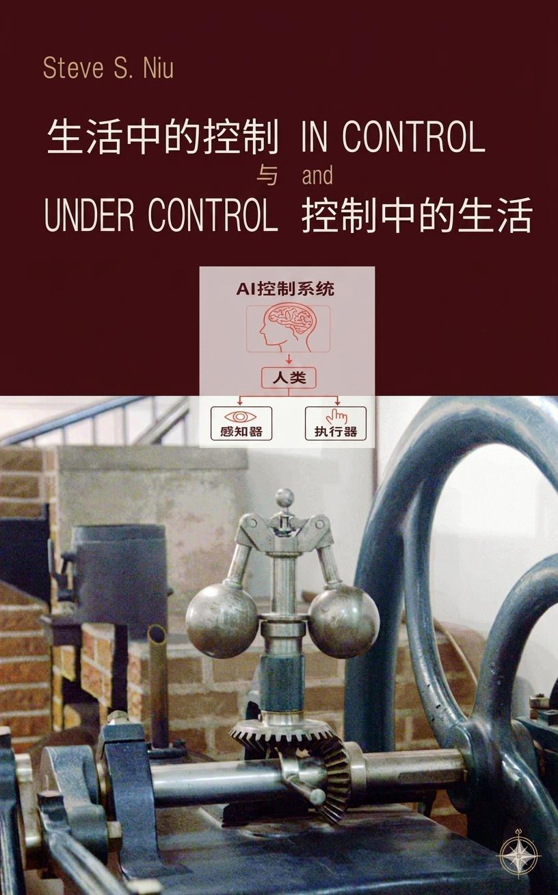

 为什么高手遇事不慌？为什么好管理让人舒服？答案藏在控制论里。

控制不只是书本上的复杂公式，也不只是维持无人机或大型工厂运转的“定海神针”，它更是一种深藏于日常生活中的思维方式与生存智慧。

作为一个在过程控制领域摸爬滚打了四十多年的老兵，从中国到世界，从学术到工业，从技术到管理，我几乎亲历了这个行业的每一个环节、扮演过其中每一种角色。多年的经历与反思让我体会到：控制本身极富趣味，却因为高冷的理论和成堆的公式让很多人望而却步，这实在有些可惜。

本书不谈理论，不用公式，只帮你把控制的底层逻辑和思维方式，变成日常生活和工作中分析问题解决问题的能力，从而可以多一分从容，少一分被动。

本书按章节顺序展开，每章相对独立。你可以从头读起，点击目录跳到你感兴趣的章节。本书会持续迭代更新。 
